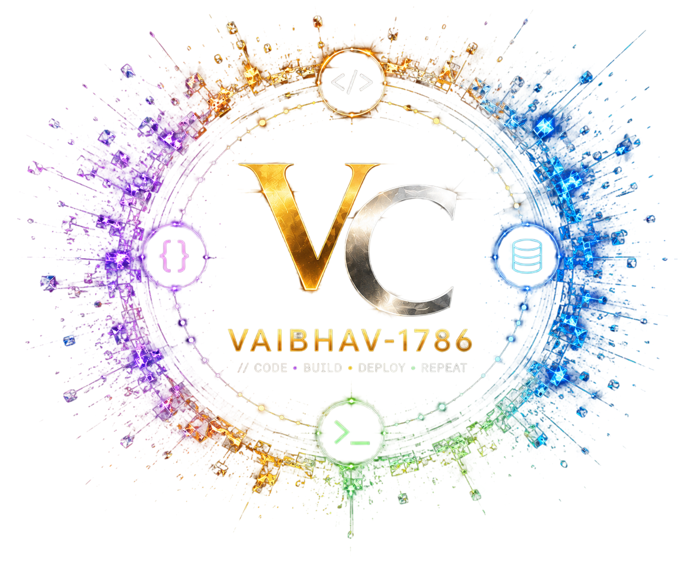

# Hi, I'm Vaibhav Chauhan 👋

### Full Stack Developer

Building scalable web applications, APIs, and business-focused software solutions.

  

---

👨‍💻 About Me

I'm a Full Stack Developer focused on building practical, reliable, and user-focused web applications.

I enjoy working across the entire development lifecycle — from designing interfaces and building APIs to working with databases and turning ideas into functional products.

- 💻 Full Stack Web Development
- 🔌 API Development & Integration
- 🗄️ Database-driven Applications
- 🎓 ERP & Business Management Systems
- 🚀 Building real-world software solutions
- 📚 Continuously learning and improving my development skills

---

🛠️ Tech Stack

Frontend

  

Backend & Database

  

---

🚀 Featured Projects

🍔 Food Delivery Platform

A multi-role food delivery platform designed to handle customer ordering, restaurant workflows, tracking, and business operations.

Highlights

- Customer ordering workflow
- Restaurant management functionality
- Order tracking
- Business-oriented features
- Full-stack application architecture

🔗 Repository:
https://github.com/Vaibhav-1786/Food_Delivery

---

🎓 PrimeTech College ERP

A college ERP solution designed to streamline administrative and academic workflows through a centralized software platform.

Highlights

- College administration workflows
- Academic management
- Centralized data management
- Automation-focused functionality
- Business process management

🔗 Repository:
https://github.com/Vaibhav-1786/PrimeTechCollege_ERP

---

🏠 Real Estate Platform

A real-estate application focused on property discovery, customer management, lead handling, and business workflows.

Highlights

- Property discovery
- Customer management
- Lead management
- CRM-oriented workflows
- Analytics and business tools

🔗 Repository:
https://github.com/Vaibhav-1786/Real_Estate-Project

---

🎯 What I'm Currently Focused On

- Building scalable and maintainable web applications
- Improving frontend and backend development skills
- Designing better APIs and database-driven systems
- Learning modern development practices
- Improving application performance and security
- Turning real-world requirements into practical software

---

🤝 Let's Connect

I'm always interested in connecting with developers, collaborating on projects, and discussing software development.

---

Build. Learn. Improve. 🚀

