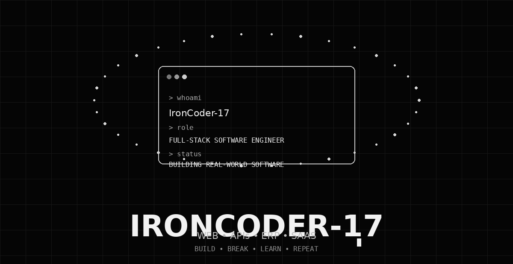

<div align="center">



# `VAIBHAV CHAUHAN`

### FULL-STACK DEVELOPER

**Web Applications • APIs • ERP Systems • SaaS Platforms**

</div>

---

## `whoami`

```text
> name       : Vaibhav Chauhan
> handle     : Vaibhav-1786
> role       : Full-Stack Developer
> focus      : Web Apps • APIs • Databases • SaaS
> mindset    : Build → Test → Improve → Ship
> status     : Building real-world software
```

I build practical, production-oriented applications with a focus on clean architecture,
useful user experiences, reliable APIs, and scalable data-driven systems.

---

## `tech_stack`

- HTML5 / CSS3 / JavaScript
- React / Node.js
- Python / MySQL
- Git / Docker

---

## `featured_projects`

### 🍔 Food Delivery Platform

Multi-role food delivery platform with customer, restaurant, payment, wallet, loyalty, and administration workflows.

### 🎓 College ERP

College management platform covering admissions, students, faculty, fees, attendance, and administration.

### 🏠 Real Estate Platform

Real-estate platform with property discovery, CRM workflows, analytics, and lead management.

---

## `engineering_interests`

```text
▸ Full-Stack Web Development
▸ REST APIs & Backend Architecture
▸ Database Design
▸ SaaS & ERP Platforms
▸ Authentication & Authorization
▸ Payment & Business Workflows
▸ Data-driven Applications
▸ Clean, maintainable code
```

---

> Animated profile banner designed around the supplied Vaibhav Chauhan / Vaibhav-1786 reference artwork.
