<picture>
  <source media="(prefers-color-scheme: dark)" srcset="./dark.svg">
  <source media="(prefers-color-scheme: light)" srcset="./light.svg">
  
</picture>

 

### Software Developer · Full-Stack Developer

I build full-stack web applications end to end — frontend, backend, and the database schema underneath. My recent work centers on React frontends paired with Node.js/Express or Python/Flask backends, running on MySQL, usually as multi-role platforms (customer, admin, and staff/restaurant portals in the same system).

 

## Featured Projects

### 🍔 Food Delivery
A full-stack food delivery platform with three separate portals — Customer, Restaurant, and Admin. Built with **React (Vite)** on the frontend, **Python/Flask** on the backend, and **MySQL** for storage. Includes ordering, cart and checkout, order tracking, a loyalty/referral system, group ordering, meal planning, and role-based access control enforced at the API level.

**Stack:** React · Vite · Flask · MySQL · JWT · Google OAuth · Razorpay

**GitHub →** [Food_Delivery](https://github.com/Vaibhav-1786/Food_Delivery.git)

---

### 🎓 PrimeTech College ERP
A full-stack campus management and community platform for colleges, combining a student social feed with core administrative modules — admissions, fee collection, results/marksheets, timetables, and attendance. Built with a **React + Vite** frontend, a **PHP REST API** for the core modules, and a **Node.js/Socket.IO** service for real-time chat and presence, all sharing a **MySQL** database.

**Stack:** React · Vite · PHP · Node.js · Socket.IO · MySQL

**GitHub →** [PrimeTechCollege_ERP](https://github.com/Vaibhav-1786/PrimeTechCollege_ERP.git)

---

### 🏠 Real Estate Project
A full-stack real-estate platform: a customer-facing property portal, a passwordless OTP-based customer account area, a role-based admin/CRM back office, a **Node.js/Express** REST API, a **Python/FastAPI** analytics microservice, and a **MySQL** database.

**Stack:** React · Node.js · Express · FastAPI · MySQL · JWT

**GitHub →** [Real_Estate-Project](https://github.com/Vaibhav-1786/Real_Estate-Project.git)

 

## Engineering Stack

| | |
|---|---|
| **Languages** | Python · JavaScript · SQL |
| **Frontend** | React · Vite |
| **Backend** | Flask · Express · PHP · Socket.IO |
| **Database** | MySQL |

 

## Connect

